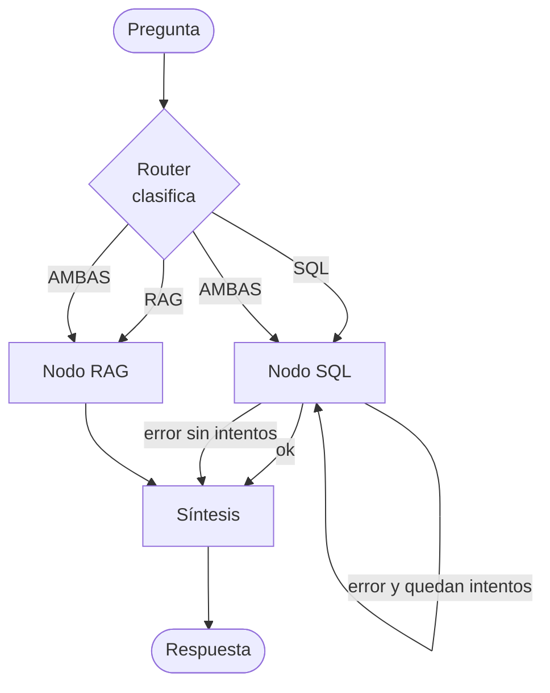

# Flujo del agente (LangGraph)

El agente es un **grafo de estados**: un objeto de estado viaja de nodo en nodo y cada nodo
lo enriquece hasta producir la respuesta final.

## Estado compartido

```
{
  pregunta:        texto de entrada del usuario
  idioma:          "es" | "en" (detectado)
  ruta:            "SQL" | "RAG" | "AMBAS"   (la decide el router)
  sql_generado:    string | null
  resultado_sql:   filas | null
  contexto_rag:    [fragmentos con fuente] | null
  intentos_sql:    entero (para el reintento)
  respuesta_final: texto
}
```

## Grafo



## Nodos

| Nodo | Entrada | Proceso | Salida |
|---|---|---|---|
| **Router** | `pregunta` | Claude clasifica en SQL/RAG/AMBAS según [reglas](#reglas-de-enrutamiento) | `ruta`, `idioma` |
| **SQL** | `pregunta`, esquema | (1) arma prompt con esquema + few-shot → (2) Claude genera `SELECT` → (3) valida (solo lectura, `LIMIT`) → (4) ejecuta → captura filas o error | `sql_generado`, `resultado_sql` |
| **RAG** | `pregunta` | embed pregunta → búsqueda top-k en pgvector → arma contexto con fuentes | `contexto_rag` |
| **Síntesis** | resultados disponibles | Claude redacta la respuesta en `idioma`, citando fuentes; aplica [grounding](grounding-policy.md) | `respuesta_final` |

## Reglas de enrutamiento

- **SQL**: preguntas sobre datos contables/relacionales (jugadores, partidas, resultados, ratings, torneos, aperturas como dato).
- **RAG**: preguntas sobre reglas, definiciones o ideas estratégicas (conocimiento textual de los PDFs).
- **AMBAS**: preguntas que mezclan un dato + un concepto en una sola frase.

## Manejo de errores (reintento de SQL)

Si el SQL falla (p. ej. columna mal nombrada), el error se le devuelve a Claude con la
instrucción de corregirlo. Máximo **1 reintento** (`intentos_sql`). Si sigue fallando, el
nodo de síntesis responde con honestidad que no se pudo resolver, sin inventar datos.

## Observabilidad

Cada ejecución del grafo se traza en **LangSmith**: se ve la ruta elegida, el SQL generado,
los fragmentos recuperados, la respuesta y el costo en tokens.
