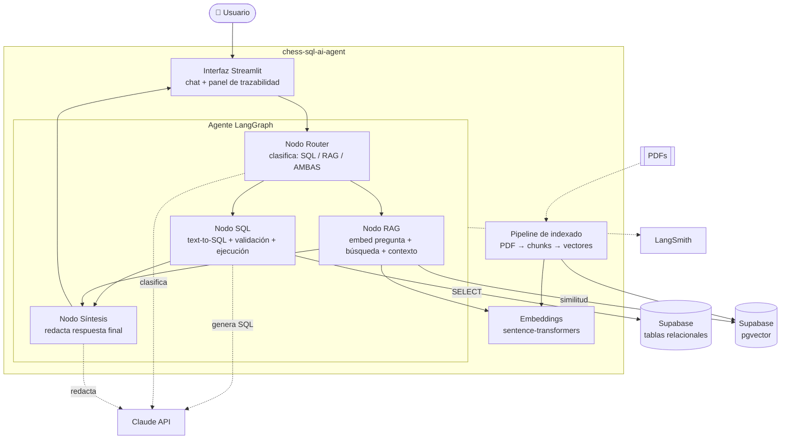

# Vista de contenedores (C4 nivel 2)

Detalle de los componentes internos del sistema y cómo se comunican.

## Componentes

| Componente | Responsabilidad | Depende de |
|---|---|---|
| **Interfaz Streamlit** | Entrada/salida con el usuario; muestra respuesta, SQL y fuentes | Agente |
| **Nodo Router** | Clasifica la pregunta en SQL / RAG / AMBAS | Claude |
| **Nodo SQL** | Genera SQL, lo valida (solo lectura), lo ejecuta y captura el resultado | Claude, Supabase (tablas) |
| **Nodo RAG** | Convierte la pregunta en vector, busca fragmentos y arma el contexto | Embeddings, Supabase (pgvector) |
| **Nodo Síntesis** | Redacta la respuesta final citando lo que corresponda | Claude |
| **Embeddings** | Vectoriza texto (multilingüe), en local | — |
| **Pipeline de indexado** | Proceso offline: PDFs → chunks → vectores en pgvector | Embeddings, Supabase |

Cada nodo es una **unidad testeable por separado** (ver [test-strategy.md](../quality/test-strategy.md)).
El flujo detallado del grafo está en [agent-flow.md](../agent/agent-flow.md).
