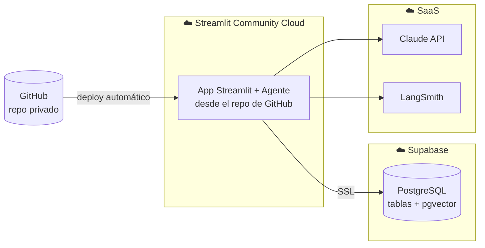

# Vista de despliegue

Dónde corre cada parte en producción y cómo se configura. Cumple el criterio de promoción
**"despliegue en la nube"** (app + base de datos en la nube).

## Componentes de despliegue

| Dónde | Qué corre | Notas |
|---|---|---|
| **Streamlit Community Cloud** | La app + el agente | Se despliega conectando el repo de GitHub; redeploy automático en cada push |
| **Supabase** | PostgreSQL + pgvector | Instancia en la nube; se accede por cadena de conexión SSL |
| **Anthropic** | Claude API | SaaS, vía API key |
| **LangSmith** | Observabilidad | SaaS, vía API key |

## Configuración (secrets)

Nunca se commitean. En **local** viven en `.env` (ver `.env.example`). En **Streamlit
Cloud** se cargan en *App settings → Secrets*:

- `ANTHROPIC_API_KEY`
- `SUPABASE_DB_URL` (y/o `SUPABASE_URL` + `SUPABASE_KEY`)
- `LANGSMITH_API_KEY`, `LANGSMITH_TRACING`, `LANGSMITH_PROJECT`

## Pasos de despliegue (resumen)

1. Crear el proyecto en Supabase, aplicar el esquema y correr el seed (datos sintéticos).
2. Habilitar la extensión `pgvector` e indexar los PDFs (pipeline de indexado).
3. En Streamlit Cloud, conectar el repo, elegir el archivo de entrada y cargar los secrets.
4. Verificar con un conjunto de preguntas de humo (smoke test) sobre la app pública.

El detalle reproducible paso a paso irá en el **README** al implementar.
