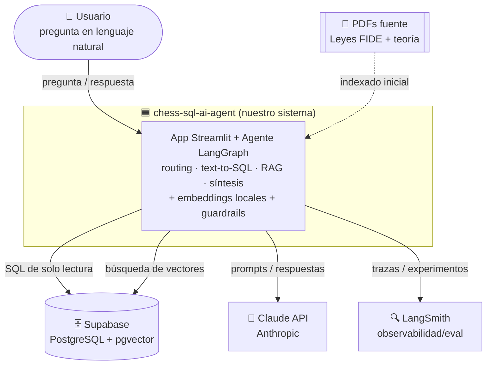

# Límite del sistema (contexto — C4 nivel 1)

Define qué está **dentro** del sistema que construimos y qué es **externo** (personas y
sistemas de terceros con los que interactúa).

## Dentro del límite (lo que controlamos)

- **Interfaz Streamlit**: recibe la pregunta y muestra la respuesta (y opcionalmente el SQL y las fuentes).
- **Agente LangGraph**: router, nodo SQL, nodo RAG y nodo de síntesis.
- **Embeddings locales** (`sentence-transformers`): corren en el mismo proceso, sin API externa.
- **Guardrails**: validación de SQL (solo lectura), límites y política de grounding.

## Fuera del límite (dependencias externas)

| Sistema externo | Rol | Responsabilidad de terceros |
|---|---|---|
| **Usuario** | Hace preguntas | — |
| **Supabase** | Almacena la BD relacional y los vectores (pgvector) | Disponibilidad y persistencia |
| **Claude API (Anthropic)** | Razonamiento: routing, text-to-SQL, síntesis | Modelo y disponibilidad |
| **LangSmith** | Traza y evalúa las ejecuciones | Plataforma de observabilidad |
| **PDFs fuente** | Insumo del RAG (se indexan una vez) | Contenido de origen |

## Alcance (scope)

**Incluye**: consultas de lectura sobre el dominio de ajedrez (datos + conocimiento textual),
en español e inglés, vía chat.

**No incluye**: edición de datos desde el chat, análisis de posiciones/motor de ajedrez,
autenticación de usuarios, ni datos en tiempo real. Ver [open-questions.md](../open-questions.md).
