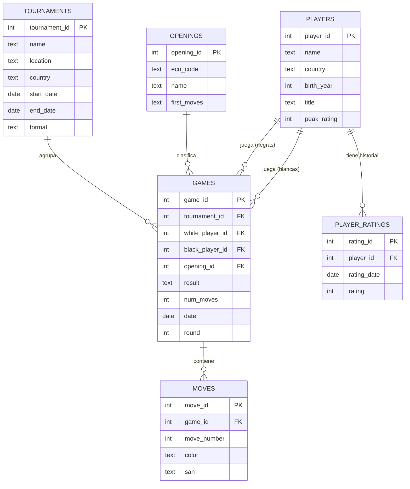

# Modelo de datos

Dominio: **partidas de ajedrez**. Base relacional en PostgreSQL (Supabase). Seis tablas;
cumple el mínimo del enunciado (≥5 tablas, ≥15 registros por tabla) con holgura.

## Diagrama entidad-relación

## Notas de diseño

- **`games`** es la tabla central: referencia jugadores (blancas y negras), apertura y torneo.
- **`moves`** guarda **una fila por media jugada (ply)** con un índice en `game_id` para que
  reconstruir una partida sea instantáneo. Ver [ADR 0003](../decisions/0003-moves-por-ply.md).
- **`player_ratings`** permite consultas de evolución temporal (series de tiempo).
- El detalle campo por campo, con tipos y valores válidos, está en el
  [diccionario de datos](data-dictionary.md).
